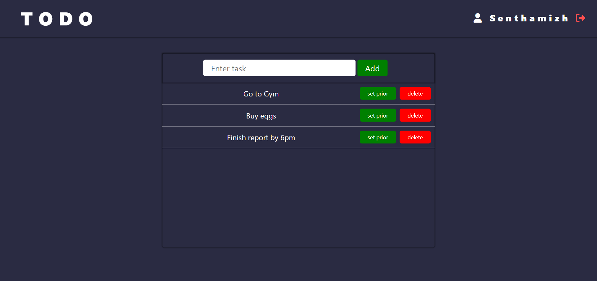

# 📝 ToDo App
A simple, elegant, and fully responsive ToDo web application built using HTML, CSS, and Django. This project helps users manage their daily tasks efficiently by allowing them to add, update, and delete their to-do items from any device.
With a clean and modern interface designed using mobile-first principles, the app ensures seamless usability across desktops and smartphones.

---
### 🔧 Features

- ✅ Add new tasks

- 📝 Update task details

- 🗑️ Delete completed or unnecessary tasks

- 🌙 Clean and responsive UI using HTML & CSS

- ⚙️ Backend logic using Django with SQLite/PostgreSQL

- 🔐 CSRF protection and Django security features
---

### 🚀 Tech Stack

| Frontend |  Backend |  Database                      |
| -------- | ------- | ----------------------------- |
| HTML5    | Django  | SQLite  |
| CSS3     | Python  |                   
---          

### 📷 Screenshots


---


## ⚙️ Setup Instructions

#### 1. Clone the Repository
```bash
git clone https://github.com/your-username/todo-app.git
cd todo-app
```
#### 2. Create and Activate Virtual Environment
```bash
python -m venv ven
source ven/Scripts/activate # windows
source env/bin/activate # MacOS
```

#### 3. Install Dependencies
```bash
pip install -r requirements.txt
```

#### 4. Apply Migrations
```bash
python manage.py migrate
```

#### 5. Run the Development Server
```bash
python manage.py runserver
```
 ***Open your browser and visit: http://127.0.0.1:8000/***

### 👨‍💻 Author
Mohamed Aadil 

ReactJS & Django Enthusiast